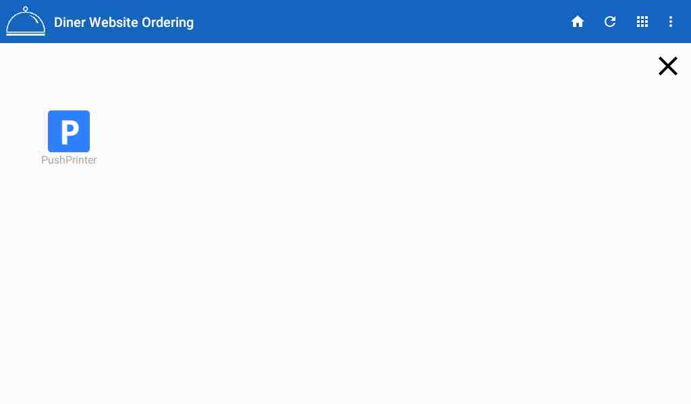

# Print Multiple Copies for Android

To print multiple copies requires changes to the tablet.

\|\| Make sure to be careful making these changes. Incorrect settings could disconnect the printer from the tablet.

1. Open the App Draw on the tablet. 

2. Select the PushPrinter App icon

3. Edit the Printer. BE CAREFUL NOT TO DELETE

4. Change the number of copies to printer and click Edit Printer. Do not make any other changes.

5. To exit out of the printer setup and return, click the circle \(O\) button at the bottom of the screen. 

